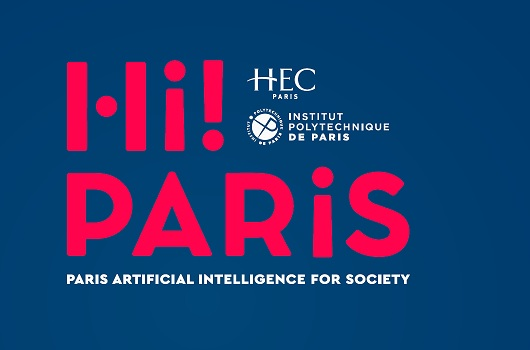

    
    <h1>Submission repository for Hi!ckathon 5</h1>
    <h3>💧 Using ML to predict water shortages during summer 🚱</h3>
    

# Original subject

This subject was proposed by Hi! Paris for this edition of the Hi!ckathon:

_"The goal is to build an AI model that can **predict the watertable/ground water** levels of french piezometric stations, with a focus on the **summer** months. To build this model, you were given piezometric/watertable, weather, hydrology, water withdrawal and economic data._

_But beyond producing an AI model, the competition will ask you to **realistically project your solution in a market** / real-world context."_

# Our deliverables

We worked in a team of six in 48 hours to bring a solution for this problem, using a technical approach (Machine Learning model) as well as a business approach (a product to sell in a market).

## Machine Learning program

The notebooks in the repository are my (Théo Vidal) personal codes for the project, as the methodology in our team was to experiment various approaches for the problem and share them with the others for their own research. 

- [Hickathon.ipynb](./Hickathon.ipynb): all data cleaning, visualization, processing pipeline with model training (XGBoost with hyperparameters search)
- [Hickathon submission.ipynb](./Hickathon%20submission.ipynb): notebook for inference based on trained weights

You can also find an [HTML visualization tool](./docs/visualization.html) to preview data on a map and see the evolution in time.

## Business report

Also available in [PDF format](./docs/water.ai%20-%20Scientific&Business%20approach.pdf)

